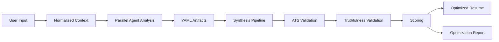

# ResumeForge

ResumeForge is a multi-agent AI system for truthful technical resume optimization and hiring intelligence.

It combines recruiter analysis, role analysis, ATS validation, archetype extraction, resume intelligence, engineering-signal optimization, and multi-agent orchestration to maximize interview probability while preserving truthfulness and technical credibility.

ResumeForge is not another resume builder, GPT wrapper, or ATS keyword spam tool. It is career intelligence infrastructure for technical professionals.

## Why ResumeForge Exists

Most resume tools fail because they:

- Keyword stuff instead of clarifying real signal.
- Hallucinate experience and fabricate metrics.
- Ignore recruiter psychology and communication style.
- Ignore role archetypes and implicit hiring expectations.
- Ignore ATS parsing constraints.
- Ignore engineering credibility, project depth, and architecture signal.
- Ignore portfolio relevance and company culture signals.

ResumeForge introduces:

- Structured hiring intelligence.
- Recruiter-aware optimization.
- Engineering-aware resume synthesis.
- Multi-agent reasoning over typed artifacts.
- ATS-aware validation pipelines.
- Truthfulness validation before generation.

## Core Pipeline



Users provide a job description, current resume, recruiter information, and optionally GitHub, LinkedIn, target company, portfolio, and projects.

ResumeForge then analyzes the role, recruiter, company, resume, and role archetype; identifies gaps and strong signals; builds structured hiring intelligence; synthesizes optimized truthful resume versions; validates ATS compatibility; validates engineering credibility; and generates optimization reports.

## Design Principles

- Truth before optimization: every claim must map to user-provided evidence or clearly marked inferred context.
- Signal over keywords: skills, systems depth, leadership, architecture, and operational impact matter more than shallow term matching.
- Structured artifacts over prompt chains: agents communicate through typed YAML contracts.
- Deterministic validation over free-form generation: validation stages gate resume synthesis.
- Provider agnostic by default: model providers are implementation details behind stable interfaces.
- Recruiter-aware but honest: adaptation should improve resonance without inventing fit.

## Planned Stack

- Python
- FastAPI
- Pydantic and typed schemas
- PydanticAI for typed agent interfaces
- LangGraph for DAG orchestration
- Async workflows
- YAML-based intermediate artifacts
- Redis or compatible task queue for distributed execution
- OpenTelemetry for traces and execution visibility

## Quick Start

Install dependencies and run tests with uv:

```bash
uv sync --extra dev
uv run --extra dev pytest
uv run ruff check .
```

Run the local pipeline against text or Markdown files:

```bash
uv run resumeforge run --job examples/job.md --resume examples/resume.md --output artifacts
```

Tailor a resume from the default example files, including PDF extraction:

```bash
uv run resumeforge tailor \
  --job examples/jd.md \
  --resume examples/my_resume.pdf \
  --output artifacts/my-tailored \
  --provider auto
```

You can pin a template with `--template classic-clean`, `--template editorial-compact`, or `--template modern-line`. If you omit it, the CLI prompts you to choose from the local `templates/` folder. The legacy aliases `jake`, `mteck`, and `rover` still work.

The `tailor` command writes:

- `tailored_resume.pdf`
- `tailored_resume.md`
- `changes.md`
- `questions.md`
- YAML validation artifacts

If the system detects missing evidence or hard requirements, it pauses in the terminal and asks follow-up questions before finishing the tailored output.
For multi-line answers, paste the block and finish it with a line containing `/done`. Use `/skip` to leave a question blank.

The built-in ATS-safe templates live locally under `templates/`:

- `templates/classic-clean`
- `templates/editorial-compact`
- `templates/modern-line`

Provider selection reads `.env` automatically. If `OPENAI_API_KEY` is set, ResumeForge uses OpenAI by default; otherwise, if `ANTHROPIC_API_KEY` is set, it uses Anthropic. You can force a provider with `--provider openai`, `--provider anthropic`, or disable LLM calls with `--provider none`.

Start the API:

```bash
uv run resumeforge serve --host 127.0.0.1 --port 8000
```

The current implementation provides deterministic, provider-agnostic agents that emit the YAML contracts described in the docs. Model-backed PydanticAI adapters can be added behind the same typed interfaces without changing the artifact schema.

## Core Agents

- Role Analyzer: extracts explicit requirements, implicit expectations, seniority, stack, workflow, domain, and hiring priorities.
- Recruiter Intelligence Agent: analyzes recruiter preferences, language style, technology interests, communication tone, and cultural signals.
- Company Analyzer: identifies engineering culture, AI maturity, stack, values, architecture patterns, and hiring philosophy.
- Resume Intelligence Agent: finds strengths, weak signals, missing signals, ATS weaknesses, engineering depth, and leadership indicators.
- Role Archetype Engine: maps the role to archetypes such as applied AI engineer, startup infrastructure engineer, forward deployed engineer, or AI-native workflow engineer.
- ATS Validation Engine: checks parser safety, keyword coverage, section consistency, formatting quality, semantic matching, and readability.
- Truthfulness Validator: ensures generated claims are grounded, defensible, and interview-safe.
- Synthesis Engine: produces optimized resumes, explanations, missing-signal recommendations, and optimization reports.

## Documentation

- [Architecture](docs/architecture.md)
- [Agent System](docs/agent-system.md)
- [ATS Validation](docs/ats-validation.md)
- [Recruiter Intelligence](docs/recruiter-intelligence.md)
- [Role Archetypes](docs/role-archetypes.md)
- [YAML Schema](docs/yaml-schema.md)
- [Roadmap](docs/roadmap.md)

## Status

ResumeForge is in early design. The current repository defines the technical architecture, agent contracts, validation philosophy, and roadmap for an open-source implementation.

## License

MIT
