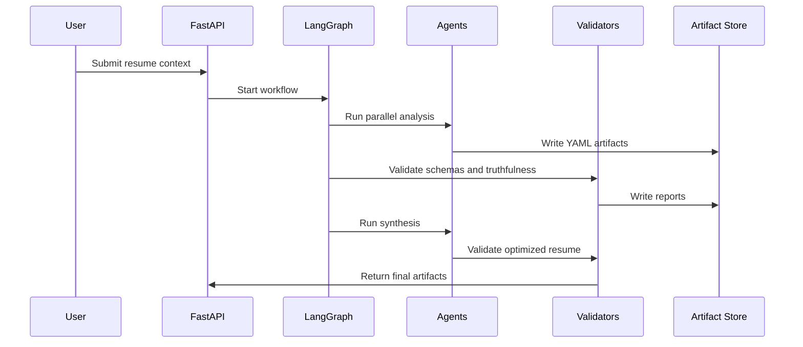

# Agent System

ResumeForge is built around specialized agents that produce typed YAML artifacts. Agents should be composable, observable, and independently testable.

## Agent Principles

Every agent must:

- Accept typed Pydantic inputs.
- Return typed Pydantic outputs.
- Serialize outputs to YAML.
- Include assumptions and confidence scores.
- Distinguish evidence from inference.
- Emit validation errors instead of silently continuing.
- Avoid fabricating user experience, metrics, projects, or skills.

## Recommended Stack

- PydanticAI for typed agent interfaces.
- LangGraph for graph execution and state transitions.
- FastAPI for service boundaries.
- Async workflows for parallel analysis.
- YAML contracts for intermediate artifacts.
- Deterministic validators for schema and policy enforcement.
- OpenTelemetry for traceability.

## Execution Model



## Core Agents

### Role Analyzer

Input:

- Job description

Extracts:

- Required skills
- Preferred skills
- Implicit expectations
- Seniority
- Culture signals
- Engineering stack
- Workflow expectations
- Architecture signals
- Hiring priorities
- Domain context
- Leadership expectations

Output:

- `role_analysis.yaml`

### Recruiter Intelligence Agent

Input:

- Recruiter name
- Recruiter profile
- Recruiter posts
- Public activity
- Company signals

Analyzes:

- Recruiter preferences
- Language style
- Technology interests
- Hiring patterns
- Communication tone
- Cultural signals

Output:

- `recruiter_profile.yaml`

### Company Analyzer

Input:

- Company name
- Website or public company context
- Engineering blog references
- Job description

Analyzes:

- Engineering culture
- Architecture patterns
- AI maturity
- Hiring philosophy
- Technical stack
- Organizational values

Output:

- `company_profile.yaml`

### Resume Intelligence Agent

Input:

- Current resume
- Optional GitHub, LinkedIn, portfolio, and project evidence

Analyzes:

- Technical strengths
- Weak signals
- Missing signals
- ATS weaknesses
- Engineering depth
- Project quality
- Leadership indicators
- Architecture indicators

Output:

- `resume_analysis.yaml`

### Role Archetype Engine

Input:

- `role_analysis.yaml`
- `company_profile.yaml`

Identifies:

- Role archetype
- Expected behavioral signals
- Expected technical signals
- Expected project types
- Expected language style

Output:

- `archetype.yaml`

### ATS Validation Engine

Input:

- Resume text or generated resume
- `role_analysis.yaml`

Validates:

- ATS compatibility
- Keyword coverage
- Formatting quality
- Parser safety
- Section consistency
- Semantic matching
- Readability

Output:

- `ats_report.yaml`

### Truthfulness Validator

Input:

- Generated resume
- Evidence map
- Resume analysis
- User-provided source materials

Validates:

- Claims map to evidence.
- Projects are real.
- Metrics are sourced or removed.
- Skills are supported by resume, GitHub, portfolio, or user input.
- Statements are defensible in interviews.

Output:

- `truthfulness_report.yaml`

### Synthesis Engine

Input:

- `role_analysis.yaml`
- `recruiter_profile.yaml`
- `company_profile.yaml`
- `resume_analysis.yaml`
- `ats_report.yaml`
- `archetype.yaml`
- `truthfulness_report.yaml`

Generates:

- Optimized resume
- Optimization explanation
- Improvement suggestions
- Missing-signal recommendations
- Resume diff

## Agent Contract Shape

```yaml
agent_name: role_analyzer
schema_version: 0.1.0
inputs:
  job_description: string
outputs:
  artifact: role_analysis.yaml
  confidence: float
  assumptions:
    - string
validation:
  required_fields:
    - required_skills
    - implicit_signals
    - hiring_priorities
```

## Deterministic Validation

LLM agents should not be trusted as validators by themselves. ResumeForge should pair model outputs with deterministic checks:

- Pydantic schema validation
- YAML parsing validation
- Section presence validation
- Claim-to-evidence mapping
- Unsupported metric detection
- ATS formatting rules
- Diff-based regression checks

## Async and Distributed Execution

The first implementation can run agents with local async tasks. The orchestration API should still support later distributed execution with Redis or another queue.

Parallelizable agents:

- Role Analyzer
- Recruiter Intelligence Agent
- Company Analyzer
- Resume Intelligence Agent

Dependent agents:

- Role Archetype Engine depends on role and company analysis.
- ATS Validation depends on resume and role analysis.
- Synthesis depends on all analysis artifacts.
- Truthfulness validation gates final output.

## Confidence Scores

Confidence scores should represent evidence quality, not model certainty alone.

Recommended levels:

- `0.9-1.0`: directly evidenced by provided sources.
- `0.7-0.89`: strongly supported by multiple signals.
- `0.5-0.69`: plausible inference with limited evidence.
- `<0.5`: weak inference; should not drive synthesis without user confirmation.
