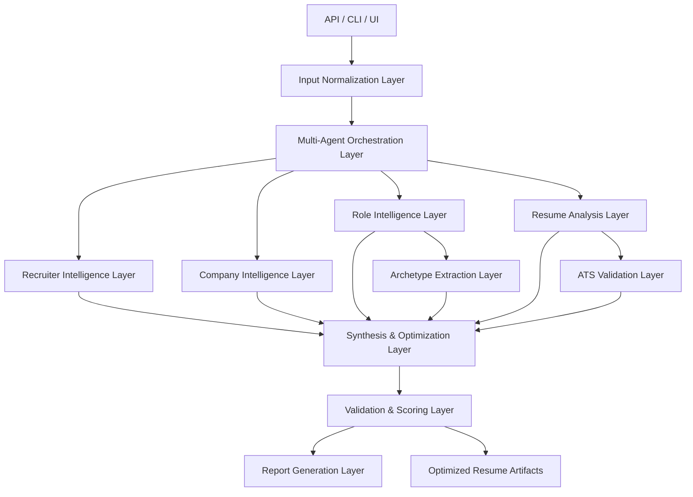
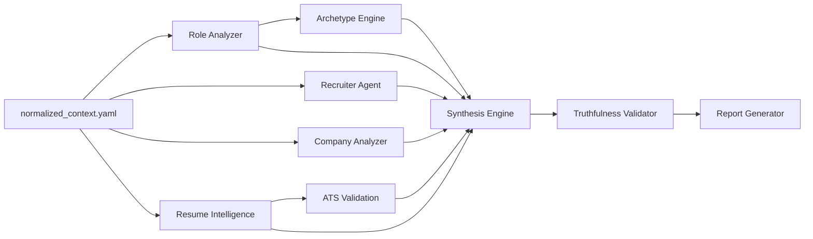
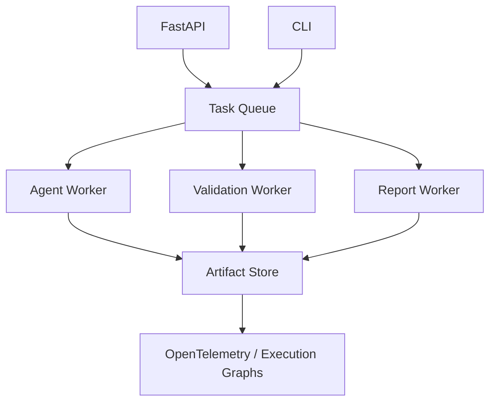

# Architecture

ResumeForge is designed as a YAML-first, typed, multi-agent orchestration system for truthful technical resume optimization.

The architecture separates enrichment, analysis, synthesis, and validation so generated resumes are explainable, reproducible, and grounded in evidence.

## System Overview

## Architecture Layers

### 1. Input Normalization Layer

Accepts raw user input and converts it into normalized typed context.

Inputs include:

- Job description
- Current resume
- Recruiter name, profile, posts, and public activity
- Target company
- GitHub, LinkedIn, portfolio, and projects
- User constraints, target seniority, and preferred tone

Outputs:

- `normalized_context.yaml`
- Parsed resume sections
- Source evidence inventory
- Redaction and privacy metadata

### 2. Multi-Agent Orchestration Layer

Coordinates the analysis DAG using LangGraph and async execution.

Responsibilities:

- Execute independent agents in parallel.
- Enforce typed input and output contracts.
- Persist YAML artifacts.
- Track lineage between artifacts.
- Retry recoverable failures.
- Emit OpenTelemetry spans.
- Gate synthesis on validation readiness.

### 3. Role Intelligence Layer

Extracts what the role explicitly asks for and what it implies.

Outputs:

- `role_analysis.yaml`
- Required skills
- Preferred skills
- Implicit expectations
- Seniority estimate
- Architecture and workflow signals
- Hiring priorities

### 4. Recruiter Intelligence Layer

Analyzes public recruiter signals and company hiring context without overfitting or making unsupported personal assumptions.

Outputs:

- `recruiter_profile.yaml`
- Communication style
- Hiring themes
- Technology interests
- Cultural signals
- Confidence-scored observations

### 5. Resume Analysis Layer

Parses the current resume into structured evidence and evaluates career signal.

Outputs:

- `resume_analysis.yaml`
- Evidence map
- Technical strengths
- Missing signals
- Weak or ambiguous claims
- Engineering depth scoring
- Leadership and architecture indicators

### 6. ATS Validation Layer

Checks parser safety and semantic alignment before and after synthesis.

Outputs:

- `ats_report.yaml`
- Formatting risks
- Section consistency issues
- Keyword and semantic coverage
- Parser safety warnings
- Readability findings

### 7. Archetype Extraction Layer

Maps the role into one or more hiring archetypes.

Outputs:

- `archetype.yaml`
- Expected technical signals
- Expected behavioral signals
- Expected project patterns
- Expected language style
- Resume strategy implications

### 8. Synthesis & Optimization Layer

Combines structured intelligence into truthful resume variants.

Outputs:

- Optimized resume
- `resume_strategy.yaml`
- Optimization explanation
- Missing-signal recommendations
- Resume diff metadata

This layer must not create unsupported claims. It can reframe, prioritize, clarify, compress, or expand existing evidence.

### 9. Validation & Scoring Layer

Scores outputs against hiring, ATS, truthfulness, and credibility criteria.

Scores include:

- ATS survivability
- Recruiter resonance
- Hiring-manager readability
- Engineering credibility
- Interview defensibility
- Role alignment

### 10. Report Generation Layer

Builds human-readable reports from YAML artifacts.

Outputs:

- Optimization report
- Resume diff
- Evidence mapping report
- Risk report
- Interview preparation notes

## Artifact Lineage

Every generated artifact should carry:

- `artifact_id`
- `schema_version`
- `created_at`
- `source_artifacts`
- `agent_name`
- `model_provider`
- `confidence`
- `assumptions`
- `validation_errors`

## Runtime Shape

Initial implementation should support local execution with FastAPI and CLI entry points. The architecture should also allow a distributed mode using Redis-backed task queues and event-driven orchestration.

