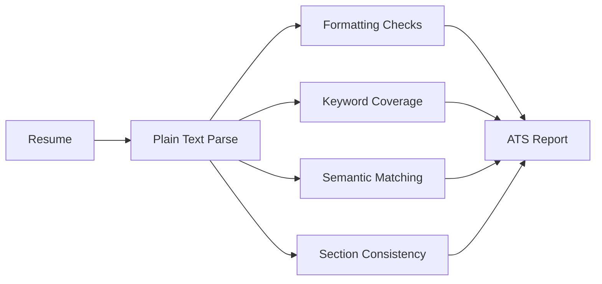

# ATS Validation

ATS validation in ResumeForge is a deterministic and semantic quality gate. Its purpose is to improve parser survivability and role alignment without encouraging keyword stuffing.

## Goals

- Preserve machine-readable formatting.
- Improve section consistency.
- Detect missing role-critical terminology.
- Validate semantic coverage.
- Avoid unsupported or unnatural keyword injection.
- Keep the resume readable for recruiters and hiring managers.

## Non-Goals

- Stuffing repeated keywords.
- Rewriting experience to match terms the user cannot defend.
- Optimizing for one parser at the expense of human readability.
- Treating ATS score as the only success metric.

## Validation Areas

### Parser Safety

Checks:

- Standard section headings.
- Plain text extraction quality.
- Minimal table dependence.
- Avoidance of image-only text.
- Consistent date formatting.
- Bullet readability.
- Link visibility.
- Contact information parseability.

### Keyword Coverage

Keyword checks should be contextual. ResumeForge should measure whether meaningful skills and concepts are represented, not whether exact terms are spammed.

Coverage types:

- Required skills
- Preferred skills
- Domain terms
- Architecture terms
- Workflow terms
- Leadership terms
- Tooling and platform terms

### Semantic Matching

Semantic matching compares the resume against role expectations:

- Does the resume show evidence of the required stack?
- Does it communicate similar problem domains?
- Does it demonstrate appropriate seniority?
- Does it contain project or impact evidence?
- Does the phrasing match recruiter and hiring-manager expectations?

### Section Consistency

Checks:

- Summary aligns with experience.
- Skills appear in experience or projects.
- Projects do not contradict employment timeline.
- Seniority claims match evidence.
- Metrics are sourced or marked as unverified.

## ATS Report

The ATS Validation Engine generates `ats_report.yaml`.

```yaml
schema_version: 0.1.0
artifact_type: ats_report
overall_score: 0.78
parser_safety:
  score: 0.92
  issues:
    - severity: low
      message: "One project URL may not be visible in plain text exports."
keyword_coverage:
  score: 0.74
  covered:
    - python
    - kubernetes
    - observability
  missing:
    - incident response
semantic_match:
  score: 0.81
section_consistency:
  score: 0.88
recommendations:
  - "Add truthful operational ownership language if supported by experience."
```

## Validation Pipeline



## Scoring Guidance

ATS score should be one component of the final interview probability estimate.

Recommended weights:

- Parser safety: 30%
- Required skill coverage: 25%
- Semantic role match: 25%
- Section consistency: 10%
- Readability: 10%

Weights should be configurable per role archetype. For example, highly regulated enterprise roles may weight parser consistency more heavily, while startup roles may weight evidence density and project signal more heavily.
